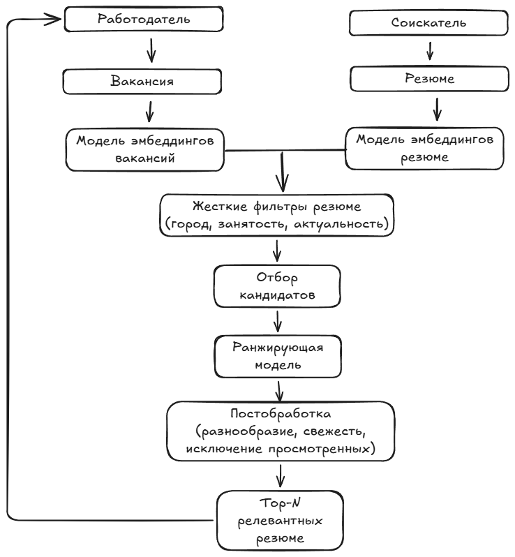

# Research
## Оценка проекта до взятия в работу
1) Оценить потенциал проекта. Насколько важно решить задачу? 
2) Есть ли простое решение? Насколько оно решит задачу? Сложно ли поддерживать такое решение?
3) Реалистичность решения проблемы с помощью машинного обучения.

## Схема решения и метрики
1) Решение с примером использования.

Cервис по параметрам вакансии автоматически подбирает и ранжирует релевантные резюме
1. Соискатели оставляют резюме на платформе, либо заполняют форму по зафиксированным полям (должность, город, навыки, опыт и т.д.). Рассчитывается эмбеддинг резюме моделью, обученной сопоставлять резюме и вакансии в общем векторном пространстве. Эмбеддинг отправляется в базу данных на сервере 
2. Работодатели размещают вакансии, заполняя форму по зафиксированным полям. Рассчитывается эмбеддинг вакансии той же моделью или совместимой моделью, чтобы можно было сравнивать вакансию и резюме по близости векторов.
3. После размещения работодателям предлагается найти подходящие опубликованные резюме.
	1. Отбираются резюме по жестким фильтрам по типу города, должности, занятость и т.д.
	2. Из отфильтрованных айтемов моделью путём сравнения эмбеддингов метрическими методами и поиска подбираются n подходящих резюме. 
	3. Список ранжируется рекомендательной ранжирующей более сложной моделью
	4. Постобработка: разнообразие, актуальность, скрытие уже просмотренных
4. отправляется обратно работодателю в интерфейс. 
5. работодатель получает релевантные резюме и может связаться по контактам из резюме с соискателем
В качестве baseline можно использовать правило: поиск резюме с совпадающим или близким заголовком профессии и совпадением ключевых фильтров

Действия работодателя (просмотр, открытие контактов, скрытие резюме, приглашение кандидата) сохраняются как события обратной связи и используются для оценки и последующего обучения ранжирующей модели

  

2) Какая бизнес-метрика должна оптимизироваться? Какое её значение будет считаться успехом?

Позитивные метрики:
- Конверсия в целевое действие: доля случаев, когда работодатель, посмотрев резюме/блок резюме, нажал "показать контакты", "написать сообщение" или другое целевое действие
- Доля найма: доля случаев, рекомендованного кандидата взяли на работу (вероятно, сложно отследить)

Негативные метрики:
- Доля быстрых отказов: доля случаев, когда работодатель, посмотрев резюме, нажал "не подходит"
- Доля без результата: доля вакансий, для которых алгоритм не смог сформировать блок рекомендаций

Успех: Рост конверсии в целевое действие при условии, что метрики доля без результата и доля быстрых отказов не растут 

3) Какая метрика машинного обучения будет наилучшим образом отражать оптимизацию бизнес-метрики?

Retrieval: Задача этапа отсеять большое количество нерелевантных кандидатов и передать топ-к потенциально релевантных кандидатов.
Их порядок на этом этапе не важен. Recall@k - оценивает способность алгоритма охватить максимум потенциально релевантных кандидатов

Ranking: Задача этапа ранжировать выдачу предыдущего.
NDCG@n - оценивает позицию кандидата в выдаче, позволяет использовать небинарную релевантность (наняли - 3 балла, открыли контакты - 2 балла, открыли резюме - 1 балл).
Этап и метрика отражают поведение пользователя: изучение только нескольких первых страниц выдачи

